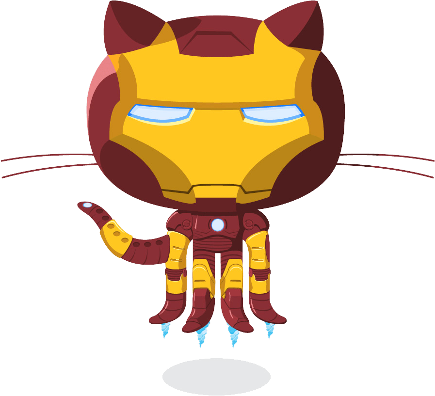

<h1 align="center">Hi :wave:, I'm kesh Gurung</h1>
<h3 align="center">A passionate frontend developer from London, UK</h3>

 

- 🔭 I'm currently studying Software Engineering Immersive @ GA, London /
- 🌱 I'm currently learning [MERN full stack web development]
- 🚀  Currently contributing on https://github.com/sclemson/OneDayIn.git
- :telescope: I’m currently working on [my react app](www.github.com/keshgurung)
- :mailbox: How to reach me **gurungkesh9@gmail.com**
- :page_facing_up: Know about my experiences [www.github.com/keshgurung](www.github.com/keshgurung)
- :zap: Fun fact **i am a left-handed person.**

<h3 align="left">Languages and Tools:</h3>

                           

## Connect With Me

<!-- 
 -->

